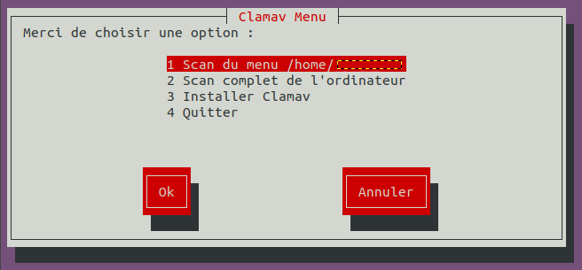

## Features

**Interface graphique**
*  via Whiptail

**Réparation**
* Scan du menu /home/utilisateur
* Scan complet de l'ordinateur
* Installer Clamav
    - L'installation de Clamav est possible seulement si il n'est pas déjà sur la machin.
* Quitter

## How To Use

Télécharger le script, ouvrir un terminal puis :

```bash
# Au premier lancement, s'assurer que celui-ci est exécutable 
$ sudo chmod +x clamav-scan.sh

# Exécuter le script 
$ sudo bash clamav-scan.sh
```



Hotkeys :
* **Navigation** : *Flèches directionnelles*
* **Changer de contexte** : *Tabulation*
* **Valider** : *Entrée*

## Credits

- Adrien J